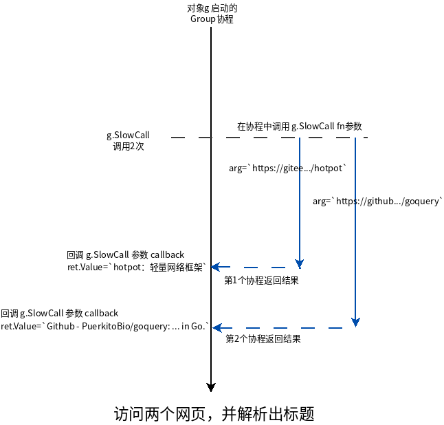
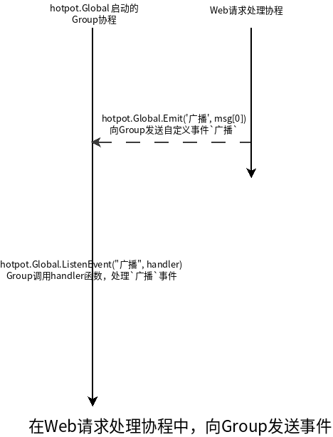
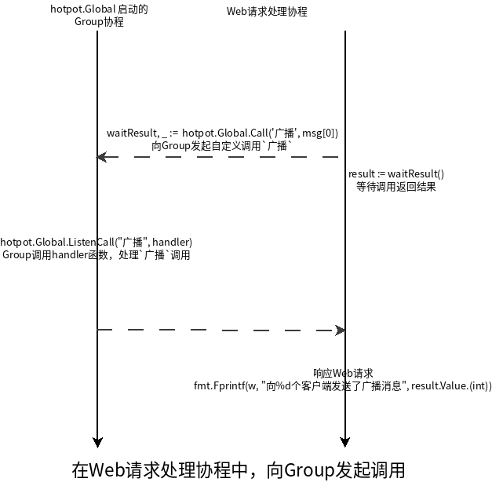

# Group使用说明

## 基础功能

### 用法举例1 - 慢调用

请求两个页面，解析出页面标题，并打印出来。当然，我们希望同时请求这两个页面，以节省时间。这时，可直接使用Group慢调用`SlowCall()`方法实现，思路是：

为每个页面分配协程，获取数据并解析出文档标题，再将结果交给Group协程处理。

[完整示例代码](example/slowcall/main.go)

代码中协程同步模型如下图



在SlowCall中，Group协程将耗时操作放入新协程中处理，并将处理结果汇聚到自身协程中，避免耗时操作导致数据处理排队，提高了数据处理效率。

> 每次调用SlowCall都会启动一个协程，调用fn函数，把arg作为fn的入参；  
> 当fn返回时，返回值通过chan传回到Group协程，Group协程立即调用callback函数，而fn返回值，将作为调用callback的参数传入。

### 用法举例2 - 事件

为websocket服务器实现Web API。比如，给echo服务器实现一个广播消息接口。

我们必需另启一个主机端口，用于监听HTTP请求，另外还的在API请求时，与Group协程交互。
众所周知，HTTP服务器的并发策略是，每个请求分配单独的协程，与Group协程通讯时，就存在跨协程问题，Group的`Emit()`、`Call()`方法将这种情况封装起来，简化了代码书写难度。

```golang
    // 主要代码
    // 监听`广播`事件
    hotpot.Global.ListenEvent("广播", func(arg interface{}) {
        for _, a := range am.Agents() {
            a.WriteMsg(&Broadcast{Message: arg.(string)})
        }
    })

    // 向Group发出`广播`事件
    hotpot.Global.Emit("广播", msg[0])
```

[完整示例代码](example/webapi/event/main.go)

```md
### 启动服务 go run ./example/webapi/main.go
### 打开多个 http://www.websocket-test.com/ 连接到 ws://localhost:8848
### 在浏览器中访问地址 http://127.0.0.1:4000/broadcast?msg=这是一条广播消息

### 客户端1
    服务器 12:2:35
    {\type\:\Broadcast\,\data\:{\Message\:\这是一条广播消息\}}

### 客户端2
    服务器 12:2:35
    {\type\:\Broadcast\,\data\:{\Message\:\这是一条广播消息\}}
```



使用`Emit()`方法，向Group协程发送事件，最终Group将在自己的协程里，调用`ListenEvent()`注册的函数，作出对事件的实际处理。

我们可以看出Group的事件是异步的，不需要关心事件接收函数的执行结果。些时候，我们需要与Group通讯，并接收其处理结果，这时就需要用到Group的`Call()`方法。

### 用法举例3 - 调用

在例2的基础上，返回广播实际发送的客户端数量。

```golang
    // 主要代码
    // 监听`广播`调用
    hotpot.Global.ListenCall("广播", func(arg interface{}) hotpot.Return {
        var count int
        for _, a := range am.Agents() {
            count++
            a.WriteMsg(&Broadcast{Message: arg.(string)})
        }

        return hotpot.Return{Value: count}
    })

    // 调用Group中的`广播`处理函数
    waitResult, _ := hotpot.Global.Call("广播", msg[0])
    // 等待调用返回结果
    result := waitResult()
```

[完整示例代码](example/webapi/call/main.go)

```md
### 启动服务 go run ./example/webapi/main.go
### 打开多个 http://www.websocket-test.com/ 连接到 ws://localhost:8848
### 在浏览器中访问地址 http://127.0.0.1:4000/broadcast?msg=这是一条广播消息

### 客户端1
    服务器 12:2:35
    {\type\:\Broadcast\,\data\:{\Message\:\这是一条广播消息\}}

### 客户端2
    服务器 12:2:35
    {\type\:\Broadcast\,\data\:{\Message\:\这是一条广播消息\}}

### 广播页面
    向2个客户端发送了广播消息
```



与`Emit()`方法相比，`Call()`多出了同步返回结果，这意味着它会引发阻塞等待，不过对应HTTP这种一个请求一个协程的情形，等待必要结果是合理的，不会因此影响除该请求之外的其他请求。

另外，Group还提供了延时方法`AfterFunc`，用途同 time.AfterFunc

### 用法举例4 - 延时调用

让echo服务器定时广播消息

```golang
// 主要代码

func main() {
    // ... 省略创建服务器代码

    // 每隔5秒钟，全服广播一次服务器当前时间
    hotpot.Global.AfterFunc(time.Second*5, broadcastServerTime(am))
}

func broadcastServerTime(am hotpot.IAgentMgr) func() {
    return func() {
        // 全服广播一次服务器当前时间
        s := "当前服务器时间：" + time.Now().Format("2006-01-02 15:04:05")
        for _, a := range am.Agents() {
            a.WriteMsg(&Broadcast{Message: s})
        }

        // 设置下一次定时广播
        hotpot.Global.AfterFunc(time.Second*5, broadcastServerTime(am))
    }
}
```

[完整示例代码](example/webapi/afterfunc/main.go)

运行结果

```md
### 启动服务 go run ./example/webapi/main.go
### 打开多个 http://www.websocket-test.com/ 连接到 ws://localhost:8848
### 在浏览器中访问地址 http://127.0.0.1:4000/broadcast?msg=这是一条广播消息

### 客户端1
    服务器 14:4:24
    Websocket连接已建立，正在等待数据...
    服务器 14:4:24
    {\type\:\Broadcast\,\data\:{\Message\:\当前服务器时间：2021-03-09 14:04:24\}}
    服务器 14:4:29
    {\type\:\Broadcast\,\data\:{\Message\:\当前服务器时间：2021-03-09 14:04:29\}}
    服务器 14:4:34
    {\type\:\Broadcast\,\data\:{\Message\:\当前服务器时间：2021-03-09 14:04:34\}}
    服务器 14:4:39
    {\type\:\Broadcast\,\data\:{\Message\:\当前服务器时间：2021-03-09 14:04:39\}}
    服务器 14:4:44
    {\type\:\Broadcast\,\data\:{\Message\:\当前服务器时间：2021-03-09 14:04:44\}}

### 客户端2
    服务器 14:4:19
    Websocket连接已建立，正在等待数据...
    服务器 14:4:19
    {\type\:\Broadcast\,\data\:{\Message\:\当前服务器时间：2021-03-09 14:04:19\}}
    服务器 14:4:24
    {\type\:\Broadcast\,\data\:{\Message\:\当前服务器时间：2021-03-09 14:04:24\}}
    服务器 14:4:29
    {\type\:\Broadcast\,\data\:{\Message\:\当前服务器时间：2021-03-09 14:04:29\}}
    服务器 14:4:34
    {\type\:\Broadcast\,\data\:{\Message\:\当前服务器时间：2021-03-09 14:04:34\}}
    服务器 14:4:39
    {\type\:\Broadcast\,\data\:{\Message\:\当前服务器时间：2021-03-09 14:04:39\}}
    服务器 14:4:44
    {\type\:\Broadcast\,\data\:{\Message\:\当前服务器时间：2021-03-09 14:04:44\}}
```

实时上，Group的`AfterFunc`方法，基于`SlowCall`实现，将消耗时间的`time.After`操作放在另外的协程中使用，并在超时后，在Group协程里回调callback函数。

## 进阶

### 聚合通道

聚合通道数据，扇入（Fan-in），由Group协程处理

```golang

// 自定义数据处理器
// 处理Group中的聚合数据
type Processor struct{}

func (p Processor) Name() string {
    return "MyProcessor"
}

func (p Processor) OnData(data interface{}) interface{} {
    fmt.Println("recv:", data)
    return nil // 次处已经处理完data，不再向后传递
}

func main() {

    // 构建一个组，并设定自定义数据处理函数
    g := hotpot.NewGroup(hub.GroupHandles(&Processor{}))

    // 聚合chan通道
    // 交由Processor.OnData处理
    ch1 := make(chan interface{})
    ch2 := make(chan interface{})
    ch3 := make(chan interface{})
    g.Attach(ch1)
    g.Attach(ch2)
    g.Attach(ch3)

    // 向chan中写入数据
    go func() { ch1 <- 1 }()
    go func() { ch2 <- 2 }()
    go func() { ch3 <- 3 }()

    // wait finished
    ch := make(chan os.Signal, 1)
    signal.Notify(ch, syscall.SIGTERM, syscall.SIGQUIT, syscall.SIGINT)
    <-ch
}
```

[完整示例代码](example/group/attach/main.go)

### 数据处理队列

Group支持添加多个数据处理器到队列，按照顺序逐个调用。

```golang
// 打印数据处理器
type PrintProcessor struct{}

func (PrintProcessor) Name() string {
    return "Print"
}

func (PrintProcessor) OnData(data interface{}) interface{} {
    fmt.Println("final:", data)
    return nil // 次处已经处理完data，不再向后传递
}

// 翻倍数据处理器
type TimesProcessor struct{}

func (TimesProcessor) Name() string {
    return "Times×2"
}

func (TimesProcessor) OnData(data interface{}) interface{} {
    data = data.(int) * 2
    fmt.Println("Times×2:", data)
    return data // 次处已经处理完data，交给队列后边的处理器，继续处理
}

// 过滤据处理器
type FilterProcessor struct{}

func (FilterProcessor) Name() string {
    return "Filter"
}

func (FilterProcessor) OnData(data interface{}) interface{} {
    if data.(int) == 2 {
        return nil // 丢弃掉2
    }

    fmt.Println("Filter:", data)
    return data // 次处已经处理完data，交给队列后边的处理器，继续处理
}

func main() {

    // 构建一个组，并设定自定义数据处理函数
    g := hotpot.NewGroup(hub.GroupHandles(&TimesProcessor{}, &PrintProcessor{}))

    // 聚合chan通道
    // 交由Processor.OnData处理
    ch1 := make(chan interface{})
    ch2 := make(chan interface{})
    ch3 := make(chan interface{})
    g.Attach(ch1)
    g.Attach(ch2)
    g.Attach(ch3)

    fmt.Println("g.Processors：", g.Processors().String())
    g.Processors().Insert("Times×2", &FilterProcessor{})
    fmt.Println("g.Processors：", g.Processors().String())

    // 向chan中写入数据
    go func() { ch1 <- 1 }()
    go func() { ch2 <- 2 }()
    go func() { ch3 <- 3 }()

    // wait finished
    ch := make(chan os.Signal, 1)
    signal.Notify(ch, syscall.SIGTERM, syscall.SIGQUIT, syscall.SIGINT)
    <-ch
}
```

[完整示例代码](example/group/processors/main.go)

## 设计意图

问：为什么不直接用加锁关键数据，使编程更为直观。

答：不可否认，在协程数量不多时，加锁更为直观，且高效。不过，随着协程数量增加，在同一锁上竞争，导致上下文切换的成本增加，此时锁不再高效。

> 具体参考 [什么是惊群，如何有效避免惊群?](https://www.zhihu.com/question/22756773)

问：采用多个锁，拆分竞争协程，可以有效避免惊群，采用通道似乎没有必要。

答：随着锁的数量增多，同步模型不再清晰，编程复杂度也会增加。采用通道，聚合协程产生的紧耦合数据到一起处理，同步模型清晰，通过公共方法实现常用的同步模型，调用公共方法的业务开发者，几乎感知不到协程数量增加带来的同步问题。

另外，通道的缓冲、阻塞能力，可以提供更高效的并发和流控，这是锁同步无法轻易代替的。
